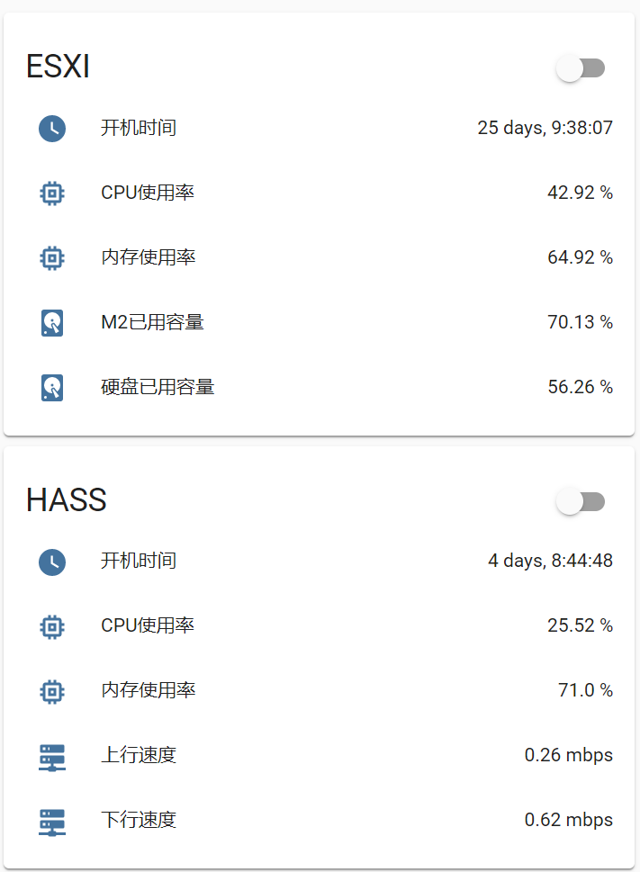

# HA_Esxi

HomeAssistant接入ESXI虚拟机状态信息

---

syjjx原帖地址: [**Vmware_Vcenter ESXi插件**](https://bbs.hassbian.com/thread-3715-1-1.html)

forked from [syjjx/HA_Esxi](https://github.com/syjjx/HA_Esxi)

**根据日志文件`home-assistant.log`查找ESXI对应内容**

```
2020-07-21 12:42:42 ERROR (SyncWorker_0) [custom_components.syjjx_esxi.sensor] {
    "datastore": [
        "Sys",
        "DSM"
    ],
    "esxi": [
        "esxi"
    ],
    "vm": [
        "Hass",
        "DSM"
    ]
}
```


**yaml配置:**

```yaml
sensor:
  - platform: ha_vcenter
    scan_interval: 60 # 扫描时间
    vchost: 10.0.0.1 # ESXI地址
    username: root 
    password: 111111 
    datastore: # 硬盘
      - type: Sys # 硬盘名称
      - type: DSM
    esxi: # ESXI状态
      - type: esxi # 主机名
        metric: ['memory','cpu','uptime'] # 显示内容
    vm: # 虚拟机
      - type: LEDE # 虚拟机名称
      # 显示内容
        metric: ['memory','cpu','if_in','if_out','uptime','io_write','io_read']
      - type: Hass
        metric: ['memory','cpu','if_in','if_out','uptime']

```


